# Nao Medical Translator 🏥✨

**Breaking Language Barriers in Healthcare with Real-time AI.**

Nao Medical Translator is a real-time, HIPAA-compliant communication platform designed to bridge the gap between doctors and patients speaking different languages. Powered by **Google Gemini 1.5** and **OpenAI Whisper**, it provides seamless text and voice translation, ensuring accurate medical context is preserved.

---

## 🌟 Key Features

*   **⚡ Real-time Translation**: Instant bi-directional translation for 50+ languages.
*   **🗣️ Voice-to-Voice**: High-fidelity audio transcription & translation using Whisper + Gemini.
*   **🩺 Medical Accuracy**: Context-aware AI prompts tuned for healthcare scenarios.
*   **🔄 Instant Sync**: WebSocket-powered chat ensures zero latency between Doctor and Patient screens.
*   **📝 Automated Summaries**: One-click generation of clinical summaries available for copy-paste into EHR systems.
*   **🔒 Secure Architecture**: Ephemeral sessions and local API key management.

---

## 🎥 Video Demo


*(Link to your demo video here)*

---

## 📐 System Architecture

Our robust architecture ensures scalability and real-time performance.

```mermaid
graph TD
    classDef client fill:#e1f5fe,stroke:#01579b,stroke-width:2px,color:#01579b;
    classDef backend fill:#e8f5e9,stroke:#2e7d32,stroke-width:2px,color:#2e7d32;
    classDef db fill:#fff3e0,stroke:#ef6c00,stroke-width:2px,color:#ef6c00;
    classDef ai fill:#f3e5f5,stroke:#7b1fa2,stroke-width:2px,color:#7b1fa2;
    classDef ws fill:#fff8e1,stroke:#fbc02d,stroke-width:2px,stroke-dasharray: 5 5,color:#f57f17;

    subgraph Clients ["💻 Frontend Clients (React + Vite)"]
        Doctor["👨‍⚕️ Doctor UI"]:::client
        Patient["🤒 Patient UI"]:::client
    end

    subgraph Server ["⚙️ Backend (FastAPI)"]
        API["🔌 REST API"]:::backend
        WSManager["📡 WebSocket Manager"]:::ws
    end

    subgraph AI ["🧠 AI Services"]
        Gemini["✨ Gemini Pro<br/>(Translation)"]:::ai
        OpenAI["🗣️ Whisper<br/>(Audio)"]:::ai
    end

    Doctor <--> API
    Patient <--> API
    API <--> WSManager
    WSManager -.-> Doctor
    WSManager -.-> Patient
    API --> Gemini
    API --> OpenAI
```



### Components
*   **Frontend**: React, Vite, Tailwind CSS (v4), Framer Motion.
*   **Backend**: Python FastAPI, SQLAlchemy (SQLite), WebSockets.
*   **AI Layer**: Dynamic integration with Google Gemini & OpenAI APIs.

---

## 🚀 Frontend Flow & Usage

### 1. Landing & Role Selection
Users start at a unified landing page where they identify their role.
*   **Doctor**: Sets their preferred language (e.g., English).
*   **Patient**: Sets their native language (e.g., Spanish, French).
*   *Action*: Clicking a role opens a **new private tab** for that user.

### 2. The Chat Interface
*   **Live Translation**: Messages sent by the Doctor in English appear instantly in Spanish for the Patient, and vice versa.
*   **Voice Input**: Hold the microphone icon to record audio. It is transcribed, translated, and played back.
*   **Original Text Toggle**: Users can verify accuracy by toggling "Show Original" on any message.

### 3. Medical Summary
*   At the end of a consultation, the Doctor can click **"Summary"**.
*   The AI generates a structured **SOAP-style note** (Subjective, Objective, Assessment, Plan) based on the chat history.
*   This summary can be copied directly to the clipboard.

---

## 🛠️ Deployment & Setup

### Prerequisites
*   Docker & Docker Compose
*   API Keys for Google Gemini & OpenAI (optional, can be entered in UI settings)

### Quick Start (Docker)
```bash
# 1. Clone Repo
git clone https://github.com/your-org/nao-medical-translator.git

# 2. Build & Run
docker-compose up --build
```
Access the app at `http://localhost:8000`.

### Manual Setup
```bash
# Backend
cd app
pip install -r requirements.txt
python main.py

# Frontend
cd ui
npm install
npm run dev
```
